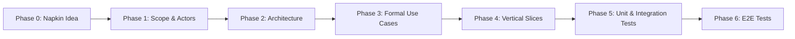
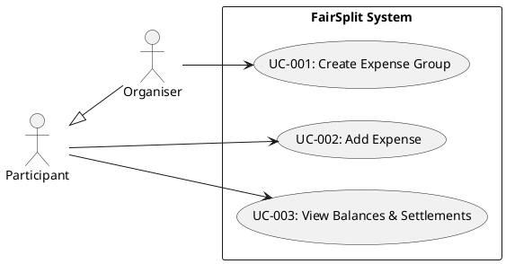

# Building FairSplit: A Practical Use Case Driven Development Walkthrough

A step-by-step guide demonstrating how to build a web application from scratch using **Use Case Driven Development (UCDD)** in TypeScript.

---

## The Workflow at a Glance

Instead of jumping straight into ad-hoc code or writing loose user stories, we follow a deterministic, traceable pipeline:

---

## Phase 0: The Napkin Idea

Every project starts with an informal, human concept. Here is our initial unrefined idea:

> *"We want a simple browser app where a group of friends can track shared expenses — like dinner, groceries, or a road trip. One person creates a group and adds participants. Anyone can log an expense and say who it's split between. At the end, the app tells everyone who owes whom and how much."*

Notice what this raw idea is missing:
- No validation rules (what if participant names are duplicate or empty?)
- No calculation specifications (how are uneven cents distributed in splits?)
- No architectural boundaries or state persistence lifecycle.

Rather than trying to solve all of this at once in code, UCDD structures the refinement into clear artifacts.

---

## Phase 1: Initial Requirements Capture (Actors & Scope)

In this phase, we translate the napkin idea into clear system boundaries and high-level use case goals.

### 1. Identifying Actors

We distinguish who interacts with the system:

| Actor | Description | Key Responsibilities |
|---|---|---|
| **Organiser** | Initiates and configures the expense group. | Creates group, sets up participant roster. |
| **Participant** | Any member belonging to an active group. | Logs shared expenses, reviews balances, inspects settlements. |

*(Note: An `Organiser` is a specialization of `Participant` who performs the initial group configuration).*

### 2. Scoping Core Use Cases

We break down the system into 3 focused, goal-oriented use cases:

1. **`UC-001: Create Expense Group`** (Primary Actor: *Organiser*)  
   *Goal*: Establish a new expense group with a designated name and participant list.
2. **`UC-002: Add Expense`** (Primary Actor: *Participant*)  
   *Goal*: Record a payment made by one participant and apportion shares to all or selected group members.
3. **`UC-003: View Balances & Settlements`** (Primary Actor: *Participant*)  
   *Goal*: View the net position of each participant and calculated instructions on how to settle debts with minimum transactions.

### 3. Visualizing the System Boundary

We formalize these relationships in a PlantUML use case diagram:

---
