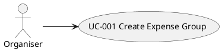

# UC-001: Create Expense Group

## 1. Brief description

The Organiser wants to initialize a new expense group with a name and participant roster in order to establish a shared ledger for tracking group expenses.

---

## 2. Local View



## 3. Actors

| Actor | Description |
|---|---|
| Organiser | The user who initiates and configures a shared expense group and defines the initial participant roster. |

## 4. Preconditions

| # | Precondition |
|---|---|
| PRE1 | The FairSplit web application is loaded in the browser. |

---

## 5. Trigger

This use case starts when the Organiser initiates group creation on the landing view.

## 6. Basic Flow

1. The Organiser enters the [Group Name].
2. The Organiser adds at least 2 [Participant Names] to the roster.
3. The Organiser selects the "Create Group" action.
4. The System checks that [Group Name] contains between 1 and 50 non-whitespace characters (see Alternative Flow 7.1).
5. The System checks that the participant roster contains at least 2 entries (see Alternative Flow 7.2).
6. The System checks that all [Participant Names] are unique within the roster (see Alternative Flow 7.3).
7. The System checks that each [Participant Name] contains between 1 and 50 non-whitespace characters (see Alternative Flow 7.4).
8. The System generates a unique identifier for the Expense Group.
9. The System generates a unique identifier for each Participant in the roster.
10. The System creates the Expense Group entity with the specified name and participants.
11. The System persists the Expense Group to local storage.
12. The System displays the Group Dashboard with an empty expense ledger and a net balance of €0.00 for each participant.
13. The use case ends.

## 7. Alternative Flows

### 7.1 Invalid Group Name

- **Divergence Point:** Step 4 of Basic Flow.
- **Condition:** [Group Name] is empty or exceeds 50 characters.

1. The System displays the error message "Group name must be between 1 and 50 characters".
2. The Organiser edits [Group Name].
3. Resume at: Step 3 of Basic Flow.

### 7.2 Insufficient Participants

- **Divergence Point:** Step 5 of Basic Flow.
- **Condition:** The participant roster contains fewer than 2 entries.

1. The System displays the error message "At least 2 participants are required to create a group".
2. The Organiser adds participant entries to the roster.
3. Resume at: Step 3 of Basic Flow.

### 7.3 Duplicate Participant Names

- **Divergence Point:** Step 6 of Basic Flow.
- **Condition:** Two or more participants in the roster share identical names (case-insensitive).

1. The System displays the error message "Participant names must be unique within the group".
2. The Organiser corrects the duplicate participant name.
3. Resume at: Step 3 of Basic Flow.

### 7.4 Invalid Participant Name

- **Divergence Point:** Step 7 of Basic Flow.
- **Condition:** A participant name is empty or exceeds 50 characters.

1. The System displays the error message "Participant name must be between 1 and 50 characters".
2. The Organiser edits the invalid participant name.
3. Resume at: Step 3 of Basic Flow.

## 8. Postconditions

### Success Postconditions

| # | Postcondition |
|---|---|
| POST1 | A new Expense Group record is persisted in local storage with the specified name and participant roster. |
| POST2 | The active application state transitions to the newly created Expense Group dashboard. |

### Failure Postconditions

| # | Postcondition |
|---|---|
| POST3 | No group record is created in local storage, and the application remains on the group creation view with entered data preserved. |

## 9. UI Sketch

```
+-----------------------------------------------------------------------+
|  FairSplit                                         [+ New Group]      |
+-----------------------------------------------------------------------+
|                                                                       |
|  CREATE NEW EXPENSE GROUP                                             |
|  Set up a shared ledger with your group in seconds.                   |
|                                                                       |
|  Group Name:                                                          |
|  [ Summer Roadtrip 2026_________________________________________ ]    |
|                                                                       |
|  Participants (min. 2):                                               |
|  1. [ Alice Enkelmann__________________________________ ]  [ x ]      |
|  2. [ Bob Miller_______________________________________ ]  [ x ]      |
|  3. [ Charlie Davis____________________________________ ]  [ x ]      |
|                                                                       |
|  [ + Add Participant ]                                                |
|                                                                       |
|  -------------------------------------------------------------------  |
|  [ Cancel ]                                   [ Create Group -> ]     |
|                                                                       |
+-----------------------------------------------------------------------+
```

#### [Create Group View]

**Fields**

- [Group Name] text input
- [Participant Name] text input list (dynamic list initialized with 2 input rows)

**Active elements**

- "Add Participant" button
- "Remove Participant" button (on each participant row; disabled when exactly 2 rows remain)
- "Create Group" button

**UI functional requirements**

- "Create Group" button is disabled when [Group Name] is blank or fewer than 2 participant rows exist.
- Pressing the Enter key in a [Participant Name] input creates and focuses a new participant row.

## 10. Special Requirements

#### 10.1 Storage Persistence
The Expense Group must be written to browser local storage synchronously upon creation.

#### 10.2 Privacy & Local-First Execution
No network calls or remote server communications are performed during group creation.

## 11. Data Requirements

| Data Item | Source / Target | Reference (Data Dictionary) | Notes |
|---|---|---|---|
| [Group Name] | Input | `ExpenseGroup.name` | 1 to 50 characters, trimmed string |
| [Participant Name] | Input | `Participant.name` | 1 to 50 characters, unique within group |
| [Group ID] | Output | `ExpenseGroup.id` | Generated unique UUID |
| [Participant ID] | Output | `Participant.id` | Generated unique UUID |
| ExpenseGroup | Domain | `ExpenseGroup` | Aggregate root entity |
| Participant | Domain | `Participant` | Entity belonging to ExpenseGroup |

## 12. API Contract

n/a (Client-side local application orchestrated via Clean Architecture interactors)
