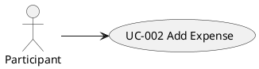

# UC-002: Add Expense

## 1. Brief description

The Participant wants to record an incurred group expense with a payer and split allocation in order to update the shared ledger and participant balances.

---

## 2. Local View



## 3. Actors

| Actor | Description |
|---|---|
| Participant | Any member belonging to the Expense Group who records a shared group expense. |

## 4. Preconditions

| # | Precondition |
|---|---|
| PRE1 | An active Expense Group with at least 2 participants exists in the current session. |

---

## 5. Trigger

This use case starts when the Participant selects the "Add Expense" action on the group dashboard.

## 6. Basic Flow

1. The Participant selects the "Add Expense" action.
2. The System displays the expense form populated with group members as payer candidates and split candidates.
3. The Participant enters the [Expense Description].
4. The Participant enters the [Amount in Cents].
5. The Participant selects the [Payer] from the participant roster.
6. The Participant selects the split method "Equal Split".
7. The Participant selects the participating members in the split roster.
8. The Participant selects the "Save Expense" action.
9. The System checks that [Expense Description] contains between 1 and 100 non-whitespace characters (see Alternative Flow 7.1).
10. The System checks that [Amount in Cents] is an integer greater than 0 (see Alternative Flow 7.2).
11. The System checks that at least 1 participant is selected in the split roster (see Alternative Flow 7.3).
12. The System divides [Amount in Cents] equally among the selected participants, allocating remainder cents sequentially starting from the first selected participant.
13. The System creates the Expense entity with the computed split allocations.
14. The System appends the Expense entity to the Expense Group ledger.
15. The System recomputes net balances for all participants in the Expense Group.
16. The System persists the updated Expense Group to local storage.
17. The System closes the expense form and displays the updated ledger and net balances on the dashboard.
18. The use case ends.

## 7. Alternative Flows

### 7.1 Invalid Expense Description

- **Divergence Point:** Step 9 of Basic Flow.
- **Condition:** [Expense Description] is blank or exceeds 100 characters.

1. The System displays the error message "Expense description must be between 1 and 100 characters".
2. The Participant edits [Expense Description].
3. Resume at: Step 8 of Basic Flow.

### 7.2 Invalid Expense Amount

- **Divergence Point:** Step 10 of Basic Flow.
- **Condition:** [Amount in Cents] is less than or equal to 0, or is not a valid number.

1. The System displays the error message "Expense amount must be greater than zero".
2. The Participant enters a valid monetary amount.
3. Resume at: Step 8 of Basic Flow.

### 7.3 No Participants Selected in Equal Split

- **Divergence Point:** Step 11 of Basic Flow.
- **Condition:** Zero participants are selected in the split roster.

1. The System displays the error message "At least one participant must be included in the split".
2. The Participant selects at least one participant.
3. Resume at: Step 8 of Basic Flow.

### 7.4 Custom Split Mode Selected

- **Divergence Point:** Step 6 of Basic Flow.
- **Condition:** The Participant selects the split method "Custom Split".

1. The System displays individual monetary input fields for each participant in the roster.
2. The Participant enters custom allocation amounts for each participant.
3. The Participant selects the "Save Expense" action.
4. The System checks that the sum of custom allocation amounts equals [Amount in Cents] (see Alternative Flow 7.5).
5. The System creates the Expense entity with the custom split allocations.
6. Resume at: Step 14 of Basic Flow.

### 7.5 Custom Split Sum Mismatch

- **Divergence Point:** Step 4 of Alternative Flow 7.4.
- **Condition:** The sum of custom allocation amounts does not equal [Amount in Cents].

1. The System displays the error message "Sum of custom shares must equal the total expense amount" and displays the unallocated delta.
2. The Participant adjusts the custom allocation amounts.
3. Resume at: Step 3 of Alternative Flow 7.4.

### 7.6 Participant Cancels Expense Entry

- **Divergence Point:** Step 2 of Basic Flow.
- **Condition:** The Participant selects the "Cancel" action.

1. The System closes the expense form without saving changes.
2. The use case ends.

## 8. Postconditions

### Success Postconditions

| # | Postcondition |
|---|---|
| POST1 | The new Expense record is appended to the Expense Group and persisted to local storage. |
| POST2 | Net balances for all participants in the Expense Group are updated to reflect the new expense and split shares. |

### Failure Postconditions

| # | Postcondition |
|---|---|
| POST3 | No expense record is added, and existing group ledger data remains unchanged. |

## 9. UI Sketch

```text
+-----------------------------------------------------------------------+
|  RECORD NEW EXPENSE                                            [ X ]  |
+-----------------------------------------------------------------------+
|  Description:                                                         |
|  [ Alpine Hut Dinner & Drinks___________________________________ ]    |
|                                                                       |
|  Amount:                                      Paid By:                |
|  [ € 180.00          ]                        [ Alice             v ] |
|                                                                       |
|  Split Method:                                                        |
|  (•) Equal Split                      ( ) Custom Allocation           |
|                                                                       |
|  Split Across:                                                        |
|  [v] Alice       (Share: €60.00)                                      |
|  [v] Bob         (Share: €60.00)                                      |
|  [v] Charlie     (Share: €60.00)                                      |
|                                                                       |
|  Allocation Summary: 3 selected · €60.00 / person · Total: €180.00    |
|  -------------------------------------------------------------------  |
|  [ Cancel ]                                       [ Save Expense ]    |
+-----------------------------------------------------------------------+
```

```text
+-----------------------------------------------------------------------+
|  Split Method:                                                        |
|  ( ) Equal Split                      (•) Custom Allocation           |
|                                                                       |
|  Custom Member Shares:                                                |
|  - Alice:   [ € 80.00      ]                                          |
|  - Bob:     [ € 60.00      ]                                          |
|  - Charlie: [ € 40.00      ]                                          |
|                                                                       |
|  [✓] Allocated: €180.00 of €180.00 (Remaining: €0.00)                 |
|  -------------------------------------------------------------------  |
|  [ Cancel ]                                       [ Save Expense ]    |
+-----------------------------------------------------------------------+
```

#### [Add Expense Form]

**Fields**

- [Expense Description] text input
- [Amount] numeric currency input (converted internally to integer cents)
- [Payer] dropdown selector
- [Split Mode] radio selector ("Equal Split" / "Custom Split")
- [Participant Split Checkbox List] (for Equal Split mode)
- [Participant Custom Share Inputs] (for Custom Split mode, with real-time allocation sum and remaining delta display)

**Active elements**

- "Save Expense" button
- "Cancel" button

**UI functional requirements**

- "Save Expense" button is disabled when [Amount] is 0 or [Expense Description] is blank.
- Switching to "Custom Split" initializes individual share inputs to 0.

## 10. Special Requirements

#### 10.1 Remainder Cent Allocation Precision
Monetary calculations must operate strictly on integer cents. When dividing an amount equally (e.g., €10.00 among 3 participants = 334¢, 333¢, 333¢), the sum of individual shares must equal the total expense amount without lost cents.

#### 10.2 Synchronous Storage Update
Group state updates must be committed to browser local storage synchronously before closing the form.

## 11. Data Requirements

| Data Item | Source / Target | Reference (Data Dictionary) | Notes |
|---|---|---|---|
| [Expense Description] | Input | `Expense.description` | 1 to 100 characters |
| [Amount in Cents] | Input | `Expense.amountInCents` | Positive integer (cents) |
| [Payer ID] | Input | `Expense.payerId` | ID of existing Participant |
| [Split Mode] | Input | `Expense.splitMode` | "EQUAL" or "CUSTOM" |
| [Split Allocations] | Input | `Expense.splits` | Array of participant ID and share in cents |
| [Expense ID] | Output | `Expense.id` | Generated unique UUID |
| Expense | Domain | `Expense` | Entity belonging to ExpenseGroup |

## 12. API Contract

n/a (Client-side local application orchestrated via Clean Architecture interactors)
