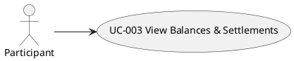

# UC-003: View Balances & Settlements

## 1. Brief description

The Participant wants to inspect individual net balances and calculated settlement recommendations in order to settle group debts with the minimal number of payment transfers.

---

## 2. Local View

## 3. Actors

| Actor | Description |
|---|---|
| Participant | Any member belonging to the Expense Group reviewing group expenditure and debt settlement instructions. |

## 4. Preconditions

| # | Precondition |
|---|---|
| PRE1 | An active Expense Group exists in local storage. |

---

## 5. Trigger

This use case starts when the Participant opens or navigates to the group dashboard.

## 6. Basic Flow

1. The Participant opens the group dashboard.
2. The System retrieves the Expense Group, expense history, and participant roster from local storage.
3. The System calculates the total group expenditure across all recorded expenses.
4. The System calculates the total amount paid by each participant.
5. The System calculates the total allocated share incurred by each participant.
6. The System calculates the Net Balance for each participant by subtracting total incurred share from total amount paid.
7. The System checks that the sum of all participant Net Balances equals 0 (see Alternative Flow 7.1).
8. The System executes the debt simplification algorithm to compute the minimal pairwise settlement transfers between debtors and creditors.
9. The System displays the Group Summary Panel containing total group spend.
10. The System displays the Net Balances Panel with positive balances formatted as surplus (creditor) and negative balances formatted as deficit (debtor).
11. The System displays the Settlements Panel with step-by-step payment instructions (e.g., "[Debtor] pays [Creditor] [Amount]").
12. The use case ends.

## 7. Alternative Flows

### 7.1 Ledger Arithmetic Inconsistency

- **Divergence Point:** Step 7 of Basic Flow.
- **Condition:** The sum of participant Net Balances does not equal 0.

1. The System displays an alert "Ledger data inconsistency detected. Please review recorded expenses."
2. The System displays unsimplified net balances without generating settlement instructions.
3. The use case ends.

### 7.2 Zero Expenses in Group

- **Divergence Point:** Step 3 of Basic Flow.
- **Condition:** The group contains 0 recorded expenses.

1. The System displays the total group spend as €0.00.
2. The System displays all participant Net Balances as €0.00.
3. The System displays the message "All participants are settled up." in the Settlements Panel.
4. The use case ends.

## 8. Postconditions

### Success Postconditions

| # | Postcondition |
|---|---|
| POST1 | The current group spend, individual participant net balances, and minimal settlement payment paths are displayed to the Participant. |

### Failure Postconditions

| # | Postcondition |
|---|---|
| POST2 | An inconsistency alert is displayed, and settlement instructions are withheld to prevent incorrect money transfers. |

## 9. UI Sketch

#### [Group Dashboard View]

**Fields**

- [Total Spend Value] display label (formatted currency)
- [Participant Balance List] (each item displaying participant name, total paid, total share, and net balance badge)
- [Settlement Instruction List] (each item displaying debtor name, creditor name, and payment amount)

**Active elements**

- "Add Expense" button
- "Refresh Ledger" button

**UI functional requirements**

- Creditor balances (> €0.00) are styled with positive color indicators (green).
- Debtor balances (< €0.00) are styled with negative color indicators (red).
- Balanced accounts (€0.00) display a "Settled" status badge.

## 10. Special Requirements

#### 10.1 Minimal Settlement Count Bound
For a group of N participants with non-zero balances, the debt simplification algorithm must produce at most (N - 1) settlement transactions.

#### 10.2 Sub-Millisecond Execution
Balance calculation and settlement computation must complete within 10 milliseconds for groups with up to 50 participants and 500 expenses.

## 11. Data Requirements

| Data Item | Source / Target | Reference (Data Dictionary) | Notes |
|---|---|---|---|
| [Total Group Spend] | Output | `GroupSummary.totalSpend` | Sum of all expense amounts in cents |
| [Net Balance] | Output | `ParticipantBalance.netBalance` | Total paid minus total share (in cents) |
| [Settlement Payer] | Output | `Settlement.fromParticipantId` | Participant ID of debtor |
| [Settlement Receiver] | Output | `Settlement.toParticipantId` | Participant ID of creditor |
| [Settlement Amount] | Output | `Settlement.amountInCents` | Positive integer (cents) |
| Settlement | Domain | `Settlement` | Value object computed from net balances |

## 12. API Contract

n/a (Client-side local application orchestrated via Clean Architecture interactors)
